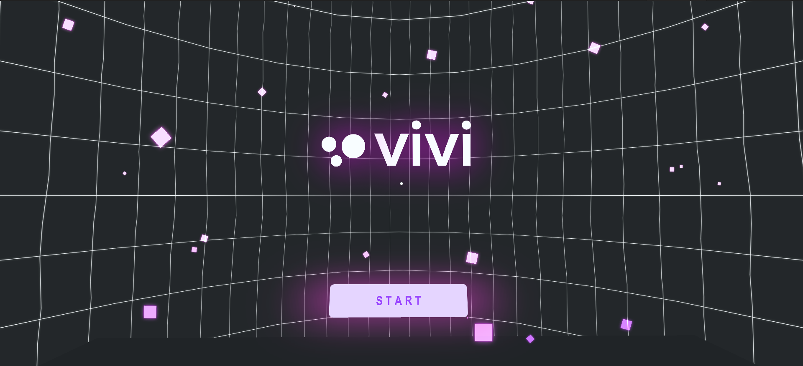
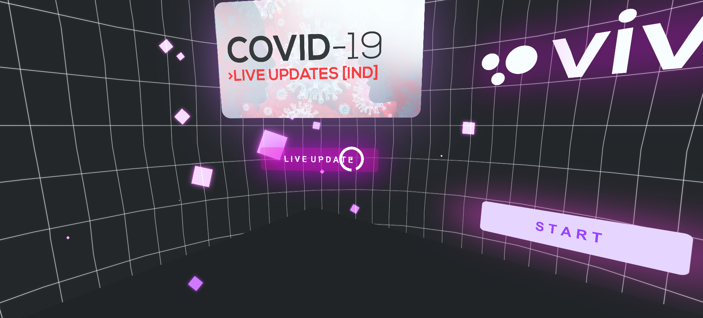
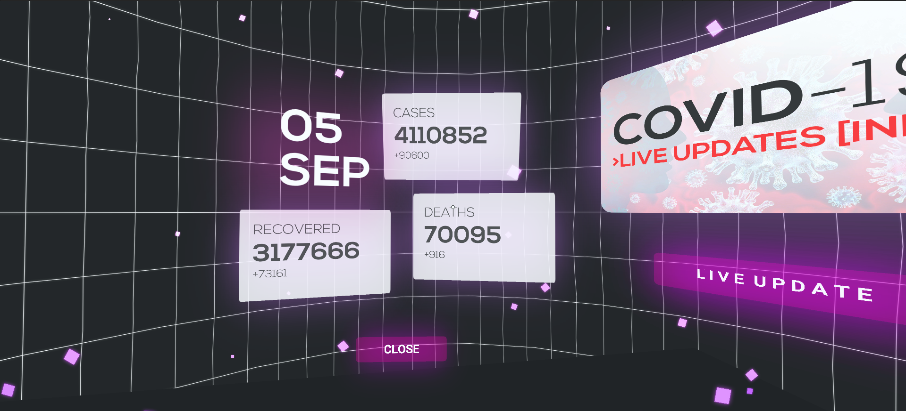
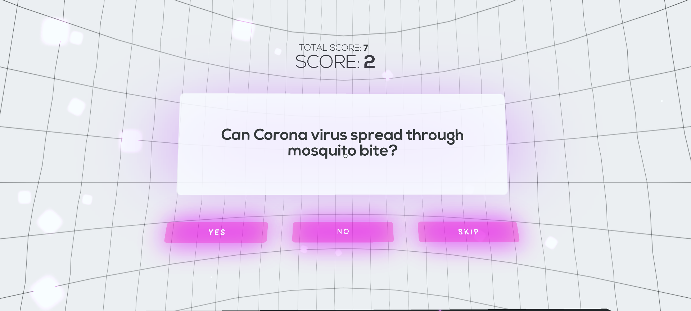
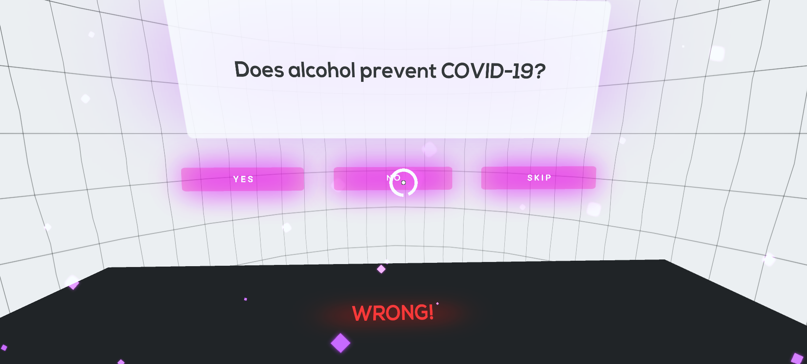

# vivi VR
> ~ play minigames, earn money, catch live updates of corona cases daily.

vivi, a virtual reality app built on Unity3D for Google Cardboard, that can help in spreading awareness about COVID-19 through immense virtual reality minigames. Playing through the game user can learn various facts about coronavirus and earn points. Points earned can later be redeemed from the shop to get various perks and cash rewards(experimental). The app also offers live data analysis of all the COVID-19 cases in India daily through an interactive sci-fi experience.

## Tech Stack:
* Unity3D
* GoogleVR SDK
* Rest API

## Snaps

## Links:
* [Download App](https://drive.google.com/file/d/18TyldoYMAOuA7UxqssKzkzAUzg906OlQ/view?usp=sharing)
* [Website](https://github.com/soilshubham/vivi)
* [Video Demo](https://youtu.be/RedgRgOm3Bc)

## Creator✨

<table>
  <tr>
    <td align="center"><a href="https://github.com/soilshubham"> <b>Sahil Shubham</b>     </a> </td>
  </tr>
</table>
